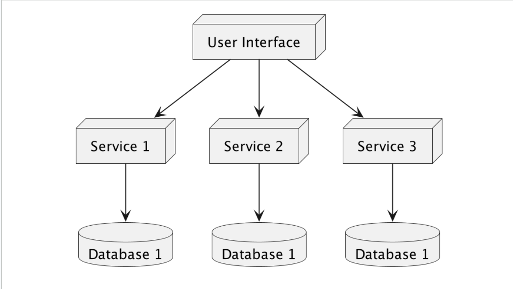

# Architecture Classification

## Introduction

- Software Architecture Patterns secara garis besar dibagi menjadi **2 klasifikasi**, `Monolithic` dan `Distributed`.
- **Monolithic** adalah `single deployment unit` atau berjalan dalam 1 aplikasi.
- **Distributed** adalah `multiple deployment units`, biasanya terdiri dari beberapa aplikasi.

## Monolithic

- Monolithic Architecture secara umum **sangat sederhana** dibandingkan dengan Distributed Architecture.
- Desain aplikasi Monolithic **lebih sederhana** dan **mudah diimplementasikan**.
- Aplikasi yang menggunakan Monolithic Architecture akan **sangat cepat dibuat** dan **didistribusikan**.

### Diagram Monolithic Architecture

## Distributed Architecture

- Distributed Architecture biasanya terdiri dari **beberapa aplikasi yang bekerja bersamaan**, berbeda dengan aplikasi monolithic yang hanya 1 aplikasi.
- Biasanya dalam distributed architecture, **setiap unit aplikasi** disebut `service`.
- Pengembangan Distributed architecture memang lebih kompleks dibandingkan dengan monolithic architecture, namun menawarkan keuntungan seperti:
  - Toleransi kesalahan (_fault tolerance_), misalnya ketika 1 service **gagal**, service lain bisa berjalan dengan normal.

### Diagram Distributed Architecture

## Pilih Yang Mana?

- Pada saat pembuatan aplikasi, kadang kita bingung menentukan harus menggunakan arsitektur Monolithic atau Distributed.
- Jika aplikasi yang akan kita buat **sederhana** atau **masih belum berjalan** secara _business requirement_, sangat **disarankan** menggunakan `Monolithic` karena mudah untuk dibuat.
- Namun, jika aplikasi yang akan kita buat **sudah sangat jelas**, dan juga memang membutuhkan **scalability yang baik**, termasuk _fault tolerance_ yang baik, maka kita bisa gunakan arsitektur `Distributed`.
