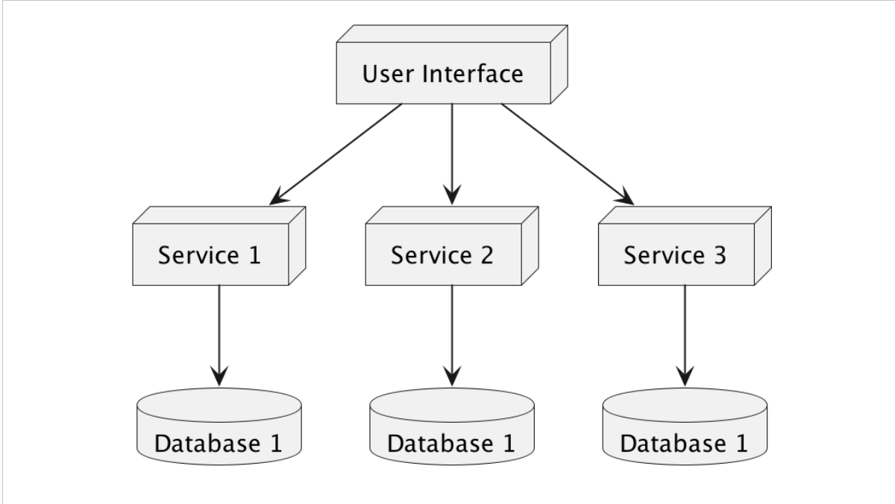
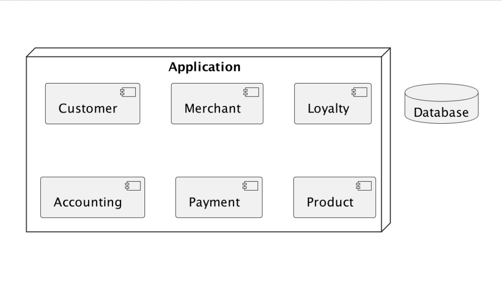

# Architecture Partitioning

## Introduction

- Selain dilihat secara klasifikasi `monolithic` atau `distributed`, software architecture juga bisa dilihat secara **struktur partisinya**.
- Software architecture baik itu `monolithic` atau `distributed`, secara partisi **bisa dibagi** berdasarkan `teknis` atau `domain`.
- Partisi secara struktur bisa digunakan di `monolithic` atau `distributed`.

## Technical Partitioning

- Arsitektur technical partitioning membagi komponen - komponen dalam sistem atau aplikasi secara teknis.
- Contoh arsitektur klasik yang sering digunakan adalah **Layered (N-Tier) Architecture**.
- Dalam technical partitioning, **komponen dalam sistem dikelompokan** secara teknis, misal:
  - `Presentation Layer`: Komponen yang menangani **user interface**.
  - `Business Layer`: Komponen yang menangani **logika** dan **aturan bisnis**.
  - `Persistence Layer`: Komponen yang menangani interaksi dengan **sistem _database_**
  - `Database Layer`: Komponen untuk **menyimpan data**.

### Diagram Layered N-Tier

## Domain Partitioning

- Berbeda dengan technical partitioning, dalam Domain Partitioning, pembagian struktur komponen dalam sistem **dikelompokan berdasarkan** `Domain` / `Fitur` / `Department` secara bisnis-nya.
- Artinya, semua technical partitioning seperti `Presentation`, `Business Logic`, `Persistence` **digabung dalam 1 per domain sistem**.
- Partisi sistem berdasarkan Domain populer sejak dikenalkan dalam buku berjudul "Domain Driven Design" karya Eric Evans.

### Diagram Domain Partitioning

## Pilih Yang Mana?

- Techincal ataupun Domain Partitioning memiliki kelebihan dan kekurangan, namun secara pribadi saya (Eko Kurniawan Khannedy) rekomendasikan gunakan:
  - `Technical Partitioning`: Aplikasi yang akan dibuat **sederhana** dan **tidak kompleks**. Selain itu, ketika jumlah anggota **tim pengembang tidak terlalu banyak**.
  - `Domain Partitioning`: Aplikasi yang akan dibuat **kompleks** dan **fitur aplikasi sangat banyak**. Serta sangat cocok ketika anggota **tim pengembang banyak** tim **berdasarkan jenis domainnya**.
