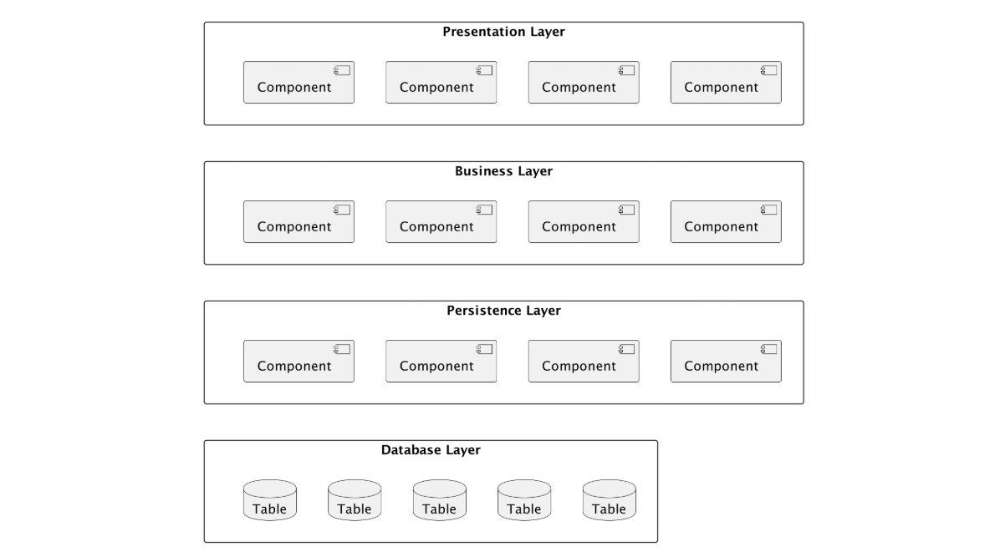
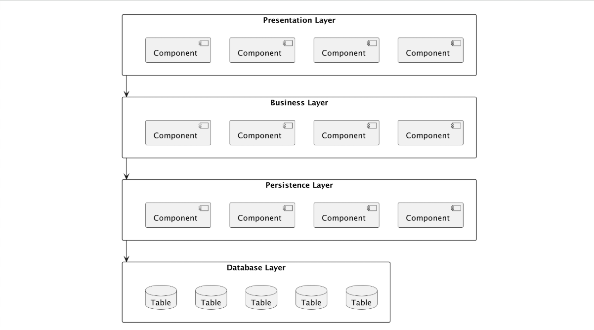
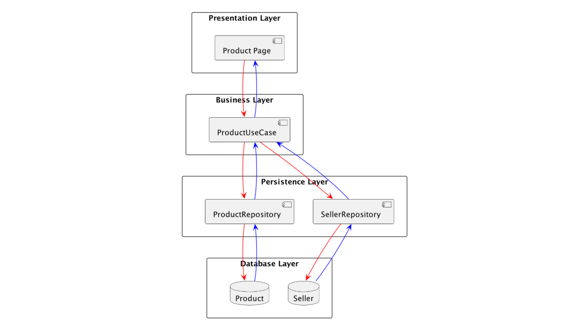

# Layered Architecture

## Introduction

- Layered Architecture dikenal juga dengan **N-Tier Architecture**.
- Arsitektur ini adalah **salah satu standard arsitektur** untuk kebanyakan aplikasi, dimana aplikasi dibagi secara teknis.
- Karena arsitektur ini sangat banyak diketahui oleh pengembang _software_, hal ini menjadikan arsitektur ini menjadi **salah satu pilihan yang banyak digunakan**.

## Komponen Layered Architecture

- Layered Architecture **dibagi secara teknis**, oleh karena itu komponen - komponen dalam Layered Architecture sama dengan `Technical Partitioning`.
- Rata - rata **banyak yang membagi menjadi 4 layer**:
  - Presentation Layer
  - Business Layer
  - Persistence Layer
  - Database Layer
- Namun, **tidak menutup kemungkinan bisa lebih banyak layer** ketika aplikasi sangat kompleks.

### Diagram

## Tugas Tiap Layer

- `Presentation Layer`: bertanggung jawab menangani semua UI.
- `Business Layer`: bertanggung jawab mengeksekusi permintaan logika atau aturan bisnis yang sesuai permintaan.
- `Persistence Layer`: bertanggung jawab untuk berinteraksi dengan database untuk melakukan pengolahan data di database.
- `Database Layer`: bertanggung jawab untuk menyimpan semua data aplikasi.

## Layer of Isolation

- Dalam Layered Architecture, **tiap layer akan terisolasi** dan arah komunikasi **hanya dilakukan** dengan layer **di bawah** atau **di atas-nya**.
- Artinya, misal ketika `Presentation Layer` ingin mengambil data Product, `Presentation Layer` akan mengirimkan request ke `Business Layer`, lalu akan mengambil data ke `Persistence Layer` dan baru masuk ke `Database Layer`.
- **Tidak direkomendasikan untuk langsung mengakses** dari `Presentation Layer` ke `Database Layer` misalnya.

### Diagram

## Contoh

- Setelah tahu cara kerja Layered Architecture, maka kita bisa dengan mudah menggambarkan alur yang harus dibuat ketika membuat aplikasi.
- Misal kita ingin **menampilkan halaman Product**, namun di dalam halaman Product **kita juga ingin menampilkan data Seller-nya**.
- Maka kita bisa buat alur aplikasi seperti pada diagram selanjutnya.

### Diagram

## Pertimbangan

- Layered Architecture adalah salah satu arsitektur yang banyak dimengerti dan digunakan.
- Gunakan Layered Architecture **jika kita masih bingung** ingin menggunakan arsitektur apa, karena **ini adalah arsitektur yang bagus untuk memulai aplikasi**.
- Namun, jangan gunakan Layered Architecture ketika pembagian tim di perusahaan sudah berdasarkan domain, lebih cocok menggunakan Distributed Architecture yang akan dibahas di materi - materi selanjutnya.
