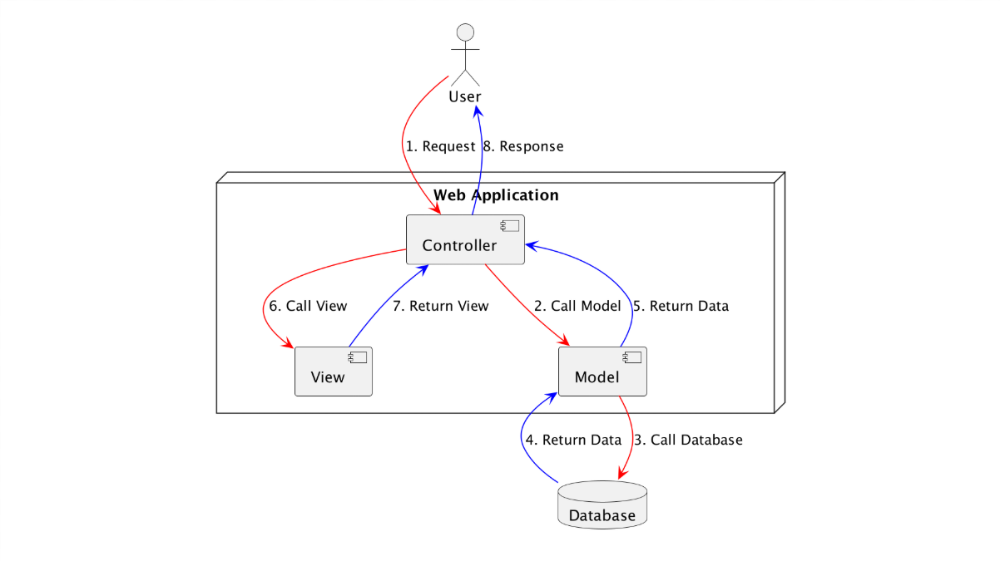
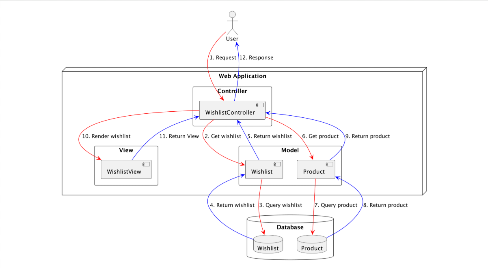

# Model View Controller Architecture

## Introduction

- Model View Controller (MVC) Architecture merupakan salah satu arsitektur yang sangat populer ketika membuat web.
- MVC **mirip** dengan `Layered Architecture`, hanya saja **layernya berbeda**.
- Dalam MVC, **pusat interaksi** antar layer biasanya dilakukan oleh `Controller`.

### Diagram

## Tugas Tiap Layer

- `Controller`: bertanggung jawab untuk menerima request dan **mengeksekusi logika** dan **aturan bisnis** yang terjadi di aplikasi.
- `Model`: bertanggung jawab **sebagai representasi data** di database dan juga **berinteraksi ke database**.
- `View`: berisikan template untuk menampilkan halaman web.
- `Database`: untuk menyimpan data aplikasi.

## Contoh

- Misal kita memiliki web, dimana terdapat 1 halaman web yang perlu untuk **menampilkan data wishlist**. Pada halaman itu, selain data wishlist, kita **juga harus menampilkan detail product** yang terdapat di wishlist tersebut.

### Diagram

## Pertimbangan

- MVC adalah **pilihan utama** ketika ingin **membuat aplikasi web**.
- Banyak sekali web framework yang **sudah secara otomatis** menggunakan arsitektur ini, seperti Laravel, NestJS, Rails, Django, dan lainnya.
- Namun ketika kita membuat **RESTful API** misalnya, **kita tidak wajib mengikuti aturan MVC**, karena biasanya kita tidak memerlukan layer `View`. Pada kasus ini, kita **bisa saja menggabungkan arsitektur** `MVC` dengan `Layered Architecture`.
