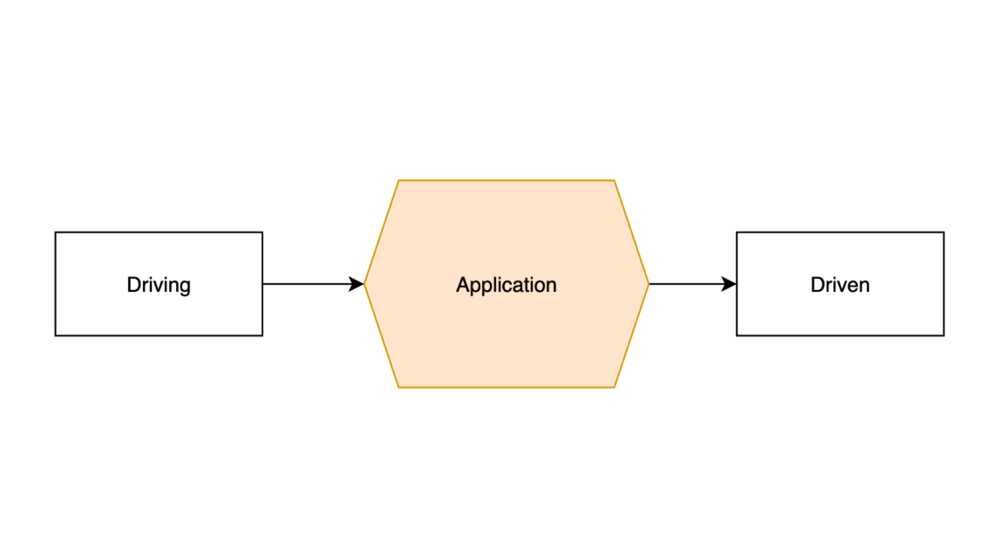
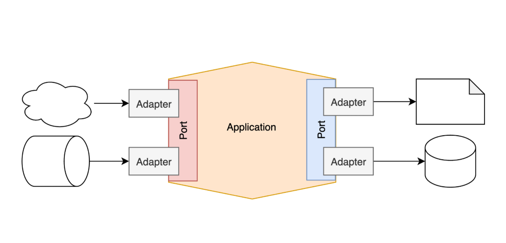
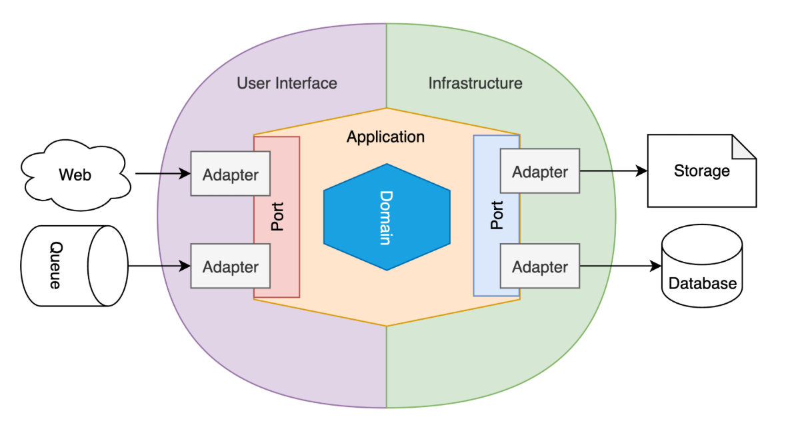
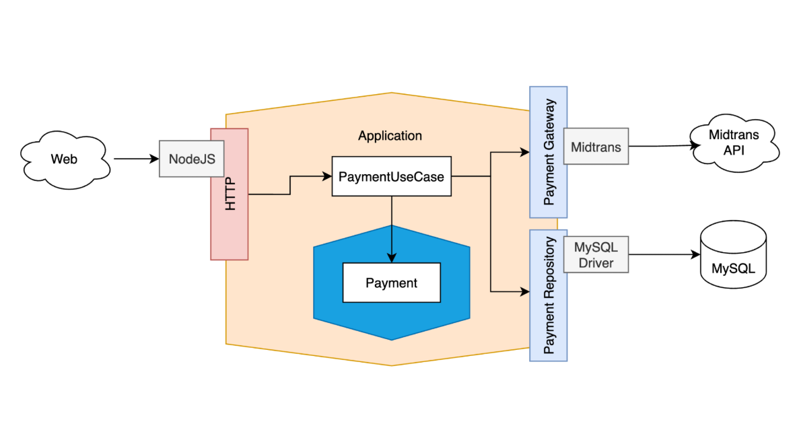

# Hexagonal Architecture

## Introduction

- Salah satu masalah ketika menggunakan Layered Architecture adalah, perubahan jenis teknologi yang digunakan, akan menyulitkan pengembangan.
- Contoh, ketika kita **ingin mengganti teknologi database** yang digunakan, secara otomatis akan terjadi perombakan besar-besaran pada kode program `Persistence Layer` dan `Database Layer`, yang **mungkin** bisa menyebabkan perombakan juga pada `Business Layer`.
- `Hexagonal Architecture` merupakan arsitektur yang **dikembangkan dari** `Layered Architecture`, namun **lebih baik** ketika menangani perubahan teknologi yang terjadi.
- `Hexagonal Architecture` juga **dikenal** dengan `Port & Adapter Architecture`.

### Diagram

## Port dan Adapter

- Hexagonal Architecture sebenarnya dikenalkan dengan nama `Port & Adapter Architecture`, namun saat ini **lebih populer dengan nama** `Hexagonal Architecture`.
- **Port** merupakan **technology-agnostic** yang merupakan sebuah `OOP Interface`, yang digunakan oleh kode program aplikasi **untuk berkomunikasi** dengan pihak lain.
- **Adapter** merupakan bagian **yang berinteraksi langsung** melalui **Port**, dan menggunakan **teknologi yang sudah ditentukan**.

### Diagram

## Application Layer

- Dalam Hexagonal Architecture, `Application Layer` akan berisi logika dan aturan bisnis, dimana kode yang dibuat akan **berinteraksi hanya dengan** `Port` tanpa tahu `Adapter` yang digunakan.
- Hal ini agar **tercapainya technology-agnostic**, sehingga ketika `Adapter` diubah, `Application Layer` tidak perlu berubah.
- Selain itu, di dalam `Application Layer`, terdapat `Domain Layer`, yang berisikan **representasi data** domain aplikasi.
- Bagian `Driving`, biasanya disebut **User Interface**, **Transport Layer**, atau **Gateway**, yaitu **sumber request masuk** ke aplikasi.
- Bagian `Driven`, biasanya disebut **Infrastructure**, **Data Source**, atau **External Interface**, yaitu **target data keluar** dari aplikasi.

### Diagram

## Clean Architecture

- Saat ini, terkenal juga arsitektur dengan nama **Clean Architecture**.
- Jangan bingung jika harus memilih `Hexagonal Architecture` atau `Clean Architecture`.
- Sebenarnya, `Clean Architecture` **tidak berbeda jauh** dengan `Hexagonal Architecture`, bahkan **penulis buku** Clean Architecture pun memang sudah menjelaskan bahwa **salah satu referensi** Clean Architecture adalah dari Hexagonal Architecture.

## Contoh

- Misal kita memiliki aplikasi toko online, dimana kita akan membuat halaman pembayaran.
- Dimana saat melakukan pembayaran, data pembayaran selain disimpan di database, akan dikirim ke Payment Gateway.

### Diagram

## Pertimbangan

- `Hexagonal Architecture` merupakan salah **satu arsitektur yang bagus** digunakan ketika kita akan membuat aplikasi **yang kompleks** dan agar aplikasinya technology-agnostic sehingga **mudah diganti - ganti**.
- Namun pengembangan `Hexagonal Architecture` tidaklah semudah `Layered Architecture`, sehingga jika pengembang belum familiar dengan `Hexagonal Architecture`, maka bisa terkendala ketika proses pengembangan.
