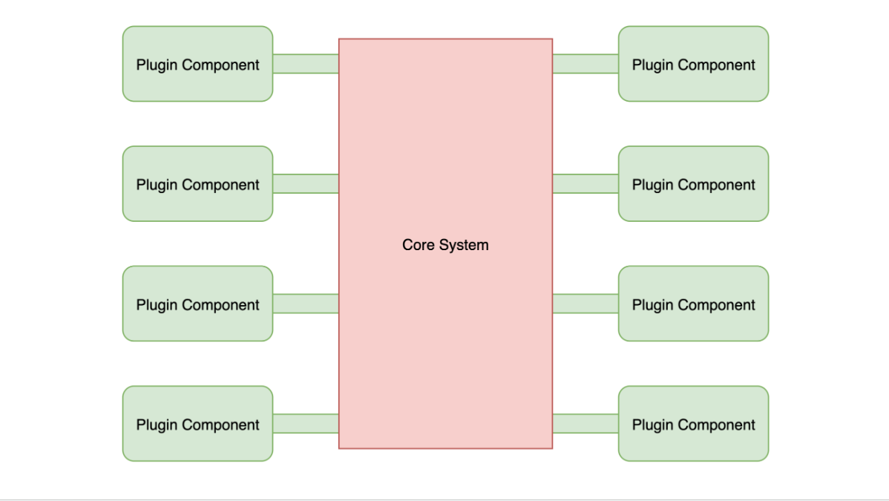

# Microkernel Architecture

## Introduction

- Microkernel Architecture sangat **flexible** dan **extensible**, sehingga pengembang bisa dengan mudah **menambah fitur** pada aplikasi dalam **bentuk extension** atau **plug-in**, tanpa takut mengganggu fungsionalitas aplikasi itu sendiri.
- Oleh karena itu, Microkernel Architecture juga sering disebut dengan **Plug-in Architecture**.
- Microkernel Architecture sangat banyak digunakan pada aplikasi berbasis **desktop biasanya**, contohnya Visual Studio Code, Eclipse, dan lainnya. Dimana ada banyak sekali extension atau plug-in yang tersedia untuk aplikasi tersebut.

### Diagram

## Topology

- Dalam Microkernel Architecture, **hanya terdapat 2 layer**, `Core System` dan juga `Plugin Modules`.
- **Logic aplikasi** di Microkernel Architecture **biasanya ditempatkan di Plugin**, maka dari itu arsitektur ini terlihat seperti `Hexagonal Architecture`, tetapi sebenarnya bukan.
- Dalam Hexagonal, logic aplikasi ditempatkan di aplikasi, sedangkan di Microkernel, detail logic aplikasi berada di tiap plugin masing - masing.

## Pertimbangan

- Microkernel sangat populer digunakan ketika membuat aplikasi Desktop berbasis plugin, seperti Visual Studio Code, Eclipse, IntelliJ IDEA, bahkan seperti browser.
- Gunakan Microkernel jika memang kita **ingin membuat aplikasi yang berbasis plugin**.
- Salah satu keunggulan Microkernel adalah **orang lain bisa berkontribusi** membuat plugin untuk aplikasi kita.
