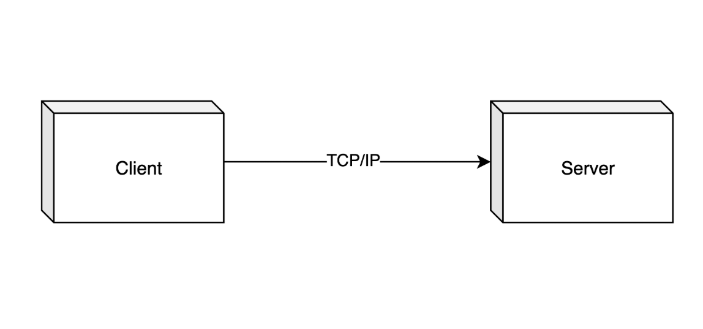
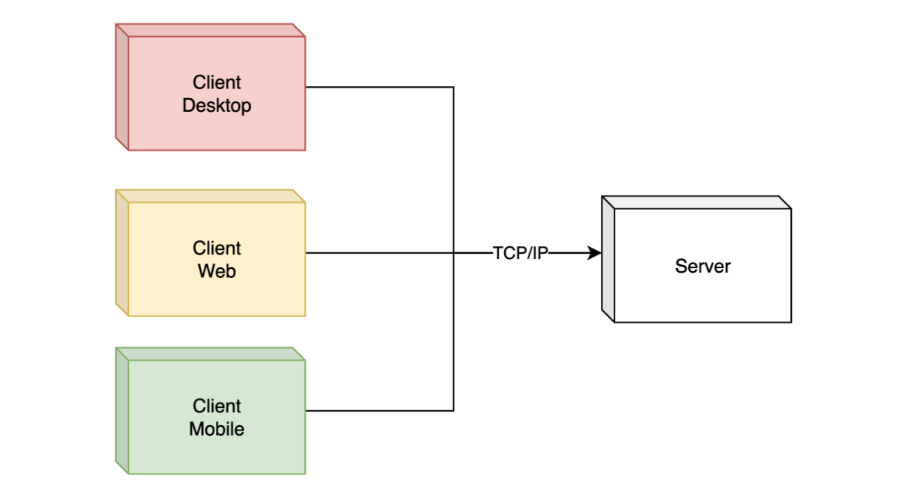

# Client Server Architecture

## Introduction

- Client Server Architecture adalah salah satu Distributed System Architecture yang banyak dikenal dan digunakan.
- Arsitektur ini sangat sederhana, dimana terdapat aplikasi `Client` dan `Server` yang **saling berinteraksi.**
- Biasanya komunikasi antara `Client` dan `Server` menggunakan **jaringan TCP/IP**, walaupun **tidak menutup kemungkinan** menggunakan jaringan lain seperti UDO.

### Diagram

## Topology

- `Client` adalah aplikasi yang **digunakan oleh pengguna** dan **berinteraksi langsung** dengan pengguna. Biasanya `Client` adalah aplikasi yg berbasis User Interface, baik itu berupa Web, Desktop, atau bisa saja berbasis Terminal. `Client` akan mengirim request yang diminta oleh pengguna ke aplikasi server.
- `Server` adalah inti dari aplikasi, dimana semua logika dan aturan bisnis dilakukan di `Server`. `Server` akan menjalankan perintah yang diminta oleh `Client`, dan mengembalikan data yang diminta ke `Client`.
- Keuntungan menggunakan Client Server Architecture adalah, kita **bisa menjalankan banyak aplikasi** jenis `Client` hanya dengan **menggunakan 1 aplikasi** `Server`.

### Diagram

## Contoh

- Client Server Architecture adalah arsitektur yang sangat banyak digunakan, bahkan mungkin secara tidak sadar, kita sudah menggunakan arsitektur ini.
- Ketika kita membuat aplikasi Mobile **yang terkoneksi ke RESTful API**, sebenarnya itu adalah Client Server Architecture.

## Pertimbangan

- Saat kita ingin membuat aplikasi yang ingin **memisahkan aplikasi** `Client` atau bahkan **membuat banyak jenis** aplikasi `Client`, maka arsitektur ini sangat cocok digunakan.
- Namun, jika kita ingin membuat aplikasi yang **standalone** **tidak butuh menyimpan data ke server**, maka kita tidak butuh membuat aplikasi Client Server, contoh seperti aplikasi editor untuk Photo, Video, dan sejenisnya.
