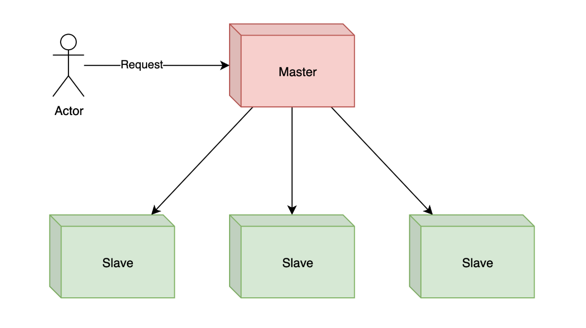
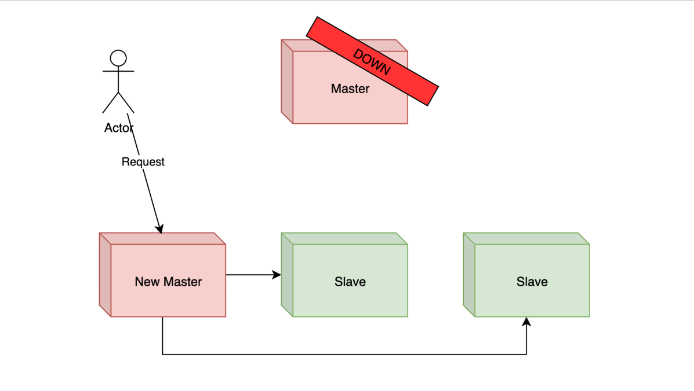
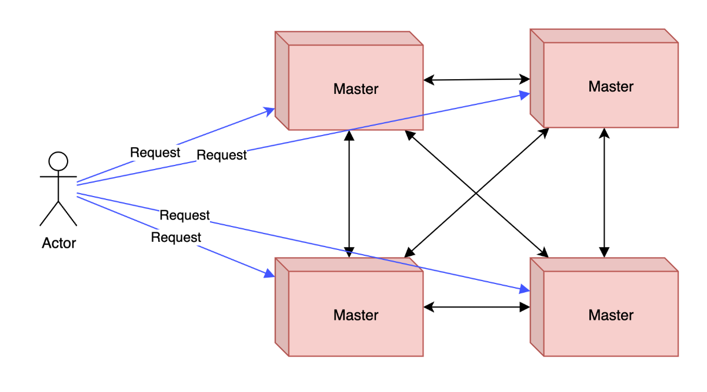

# Master Slave Architecture

## Introduction

- Master Slave Architecture merupakan arsitektur dimana **aplikasi bisa mendistribusikan semua pekerjaannya** ke aplikasi lain.
- Aplikasi yang **memerintah semua aplikasi** dinamakan `Master`, dan aplikasi yag **menerima perintah** dinamakan `Slave`.
- Sama seperti Client Server, biasanya komunikasi Master dan Slave **menggunakan jaringan TCP/IP**.

### Diagram

## Topology

- Biasanya, semua request ke aplikasi **akan lewat** aplikasi `Master`.
- Semua pekerjaan **yang diterima** oleh `Master`, biasanya akan **didistribusikan** ke aplikasi `Slave`.
- Dengan begitu, pekerjaan kita **bisa lebih cepat** karena bisa dikerjakan oleh banyak aplikasi `Slave`.
- Pada diagram, kita hanya membuat 3 `Slave`, namun kenyataannya **tidak ada batasan jumlah** aplikasi `Slave`.

## Fault Tolerance

- Salah satu **keunggulan** Master Slave Architecture adalah, **Faul Tolerance**, dimana ketika misal terjadi kesalahan yang menyebabkan salah satu aplikasi `Slave` **mati**, maka pekerjaan **masih bisa dikerjakan** oleh aplikasi `Slave` **lain**.
- Begitu juga ketika terjadi masalah yang menyebabkan aplikasi `Master` mati, maka **secara otomatis** salah satu `Slave` akan **dipromosikan** menjadi `Master` baru.

### Diagram

## Master Master Architecture

- Salah satu **kekurangan** Master Slave adalah, semua request **harus melewati** `Master`, sehingga ketika **terjadi kelambatan** di aplikasi `Master`, secara otomatis semua pengguna akan merasakan dampaknya, padahal mungkin aplikasi `Slave` tidak lambat.
- Pada kasus seperti itu, terdapat juga **Master Master Architecture**, dimana ini adalah _improvement_ dari Master Slave Architecture.
- Yang membedakan `Master Master Architecture` adalah semua aplikasi **bisa berjalan sebagai** `Master`, sehingga bisa menerima request dari pengguna secara mandiri.
- Dan karena semua aplikasi adalah `Master`, tiap **aplikasi mengirim request ke aplikasi lain**, ketika misal aplikasi sudah terlalu banyak menangani request dari pengguna.

### Diagram

## Replication

- Yang perli diingat dalam Master Slave Architecture, biasanya **data di aplikasi selalu direplikasi / duplikasi** ke semua `Slave` / `Master`.
- Hal ini agar **data selalu sama**, sehingga pekerjaan yang dikerjakan oleh semua aplikasi `Slave` / `Master` akan **selalu konsisten**.

## Contoh

- Master Slave / Master Master Architecture **jangan digunakan ketika membuat aplikasi sistem informasi**, arsitektur ini rata - rata digunakan ketika kita membuat aplikasi **statefull** (menyimpan data), seperti _Database_.
- Hampir kebanyakan aplikasi _Database_ seperti MySQL, PostgreSQL, MongoDB **mengimplementasikan** arsitektur Master Slave Architecture.
- Atau seperti aplikasi _Database_ ElasticSearch dan Cassandra, yang menggunakan Master Master Architecture.

## Pertimbangan

- Gunakan arsitektur Master Slave / Master Master ketika kita ingin membuat aplikasi yang **statefull**.
- Jika kita membuat aplikasi yang **stateless** (tidak menyimpan data), maka disarankan tidak menggunakan arsitektur ini.
