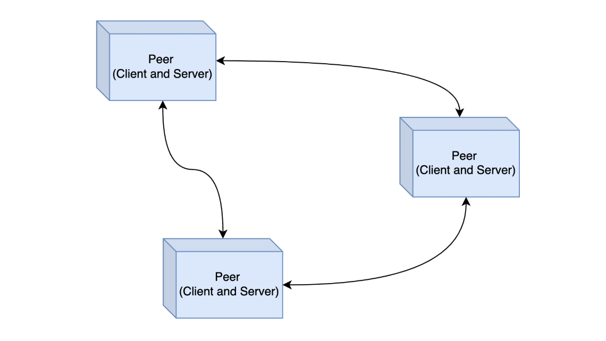

# Peer to Peer Architecture

## Introduction

- Peer to Peer Architecture merupakan arsitektur **yang hampir mirip** dengan Client Server.
- Hanya saja, dalam Peer to Peer, **semua aplikasi bisa menjadi** `Client` dan jg `Server` **secara bersamaan**.
- Biasanya logika aplikasi akan terpusat di aplikasi Server, pada Peer to Peer ,**logika aplikasi tidak terpusat** di satu aplikasi. Semua aplikasi bisa menjadi `Server` sekaligus `Client`.

### Diagram

## Topology

- Dalam Peer to Peer, seakan terlihiat sederhana namun sebenarnya **arsitektur ini sangat kompleks**.
- Setiap `Peer` bisa menjadi Client yang melakukan request ke `Peer` lain, atau bahkan **menjadi Server pada saat yang bersamaan** dengan mengirim response ke `Peer` lain.
- Oleh karena itu, pembuatan aplikasi Peer to Peer Architecture sangat kompleks karena **setiap** `Peer` **harus tahu ketika** terdapat `Peer` **baru**, karena pada kenyataannya `Peer` baru **bisa datang dan hilang kapan saja**.

## VS Master Master Architecture

- Apa bedanya Peer to Peer Architecture dengan Master Master Architecture?
- Pada Peer to Peer, `Peer` bisa menjadi `Client` ataupun `Server`.
- Sedangkan pada Master Master Architecture, tiap `Master` adalah **SERVER**, biasanya `Client` adalah aplikasi yang **terpisah dan tekoneksi** ke Master Master dengan arsitektur Client-Server.

## Contoh

- Peer to Peer banyak sekali digunakan **untuk aplikasi berbagi file**, seperti Torrent misalnya, dimana setiap orang bisa berbagi file, sekaligus meminta file ke `Peer` lain di dalam jaringan Torrent-nya.
- Selain itu, Peer to Peer jg **sering digunakan** dalam `Cryptocurrency` dimana semua data terdistribusi di semua aplikasi `Peer` untuk **menjaga data tetap aman** karena untuk mengubah data, kita harus mengubah seluruh data di dalam `Peer`, dan itu sangat sulit untuk dilakukan.

## Pertimbangan

-
