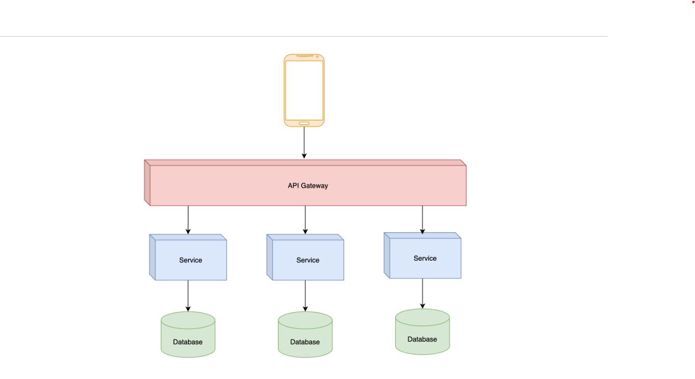
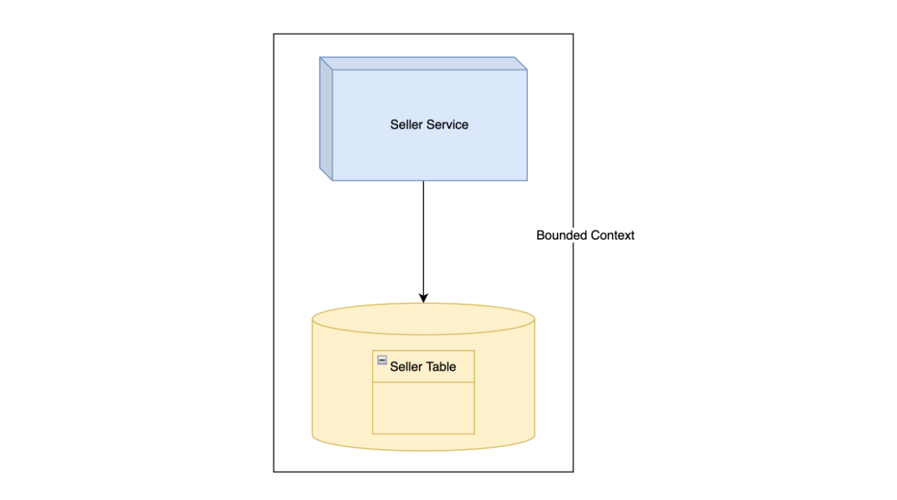
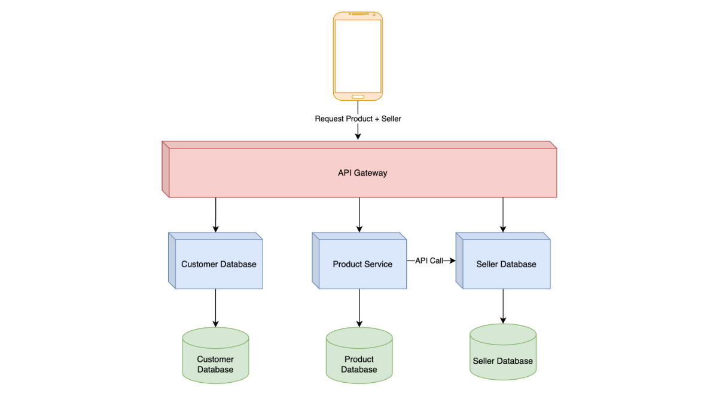

# Microservice Architecture

## Introduction

- Microservices Architecture adalah jenis arsitektur yang saat ini sedang banyak sekali digunakan oleh banyak orang. Namun jenis arsitektur ini bukanlah jenis arsitektur yang sederhana, ini adalah jenis arsitektur yang kompleks.
- Pada Microservices, sistem akan **dibuat dalam jumlah aplikasi - aplikasi kecil** atau disebut `Service`, dan digunakan untuk **menyelesaikan tugas spesifik tertentu** saja.
- Selain itu, pada arsitektur ini tiap `Service` akan di-deploy dan dijalankan **secara mandiri**.
- Pada arsitektur ini, **tidak aneh jika** sebuah sistem memiliki ratusan bahkan ribuan `Service` mandiri, hal ini karena tiap `Service` masing - masing memiliki tugasnya masing - masing.

### Diagram

## Topology

- Biasanya dalam Microservices, setiap `Service` akan berjalan secara **independent** dan memiliki _database_ **masing - masing**, tidak melakukan sharing database dengan `Service` lain.
- Biasanya juga tiap `Service` **tidak akan di-expose secara terbuka** ke pengguna, melainkan pengguna **akan melewati API Gateway**, yaitu aplikasi yang bertugas sebagai **gerbang** untuk menerima request dan meneruskan ke `Service` yg dituju.
- Karena tiap `Service` memiliki tugas masing - masing, maka **tidak jarang database yang digunakanpun bisa berbeda - beda**, hal ini karena biasanya `Service` akan menggunakan _database_ yang sesuai dengan tugas yang harus dikerjakan.

## Bounded Context

- Seperti yg sudah dijelaskan sblmnya, bahwa tiap `Service` akan memiliki dan melakukan manajemen _database_ sendiri.
- Artinya, _database_ dan _table_ tersebut hanya boleh di-akses oleh `Service` tersebut.
- Contoh misal, ketika kita memiliki `Service` yang digunakan untuk melakukan management data `Seller`, maka `Seller Service` yang hanya boleh melakukan management data `Seller` tersebut.
- Konsep ini disebut juga dengan **Bounded Context**, yang dikenalkan oleh Eric Evans pada buku **Domain-Driven Desingg** .

### Diagram

## Komunikasi Antar Service

- Dengan adanya **Bounded Context**, artinya tidak ada yang boleh mengakses _database_ `Seller` secara langsung dari `Service` lain kecuali `Seller Service`.
- Jika ada `Service` lain yg membutuhkan data `Seller`, maka `Service` lain tersebut harus meminta data `Seller` ke `Seller Service`, **dengan cara komunikasi yang sudah ditentukan**, misal RESTful API (Client-Server Architecture).

## Contoh

- Pada halaman web toko online, kita ingin menampilkan data detail `Product`.
- Namun pada halaman data detail `Product`, selain informasi `Product`, kita juga ingin menampilkan data `Seller` yang menjual `Product` tersebut.
- Pada kasus ini, kita bisa mengambil data `Product` ke `Product Service`, lalu `Product Service` meminta data `Seller` ke `Seller Service`.

### Diagram

## Pendukung

- Untuk menggunakan Microservices Architecture, biasanya tidak hanya melibatkan tim programmer.
- Banyak sekali yang harus diubah seperti **infrastructure** dan tim **product / bisnis**.
- Hal ini dikarenakan biasanya dalam Microservices, **pembagian** `Service` akan dilakukan berdasaran **Domain Bisnis**, jadi tidak sesederhana membuat aplikasi kecil.
- Pada beberapa kasus, **kesalahan pembuatan jenis** `Service` bisa mempersulit tim pengembang. Oleh karena itu, diperlukan orang `Domain Expert` atau yang sudah ahli di bidang secara bisnis.

## Pertimbangan

- Microservices Architecture biasanya digunakan di perusahaan yang sudah besar dengan tim pengembang yang banyak. Hal ini dikarenakan arsitektur ini menuntut banyak sekali pekerjaan selain pekerjaan membuat aplikasi, seperti **infrastructure**, **automation**, **deployment**, dan lainnya.
- Jangan gunakan arsitektur ini jika **tim masih kecil**, kita bisa mulai dengan `Monolithic Architecture` dan `Layered Architecture`, jika sudah waktunya membutuhkan _scaling_ tim secara cepat, kita baru bisa mempertimbangkan penggunaan Microservice Architecture.
