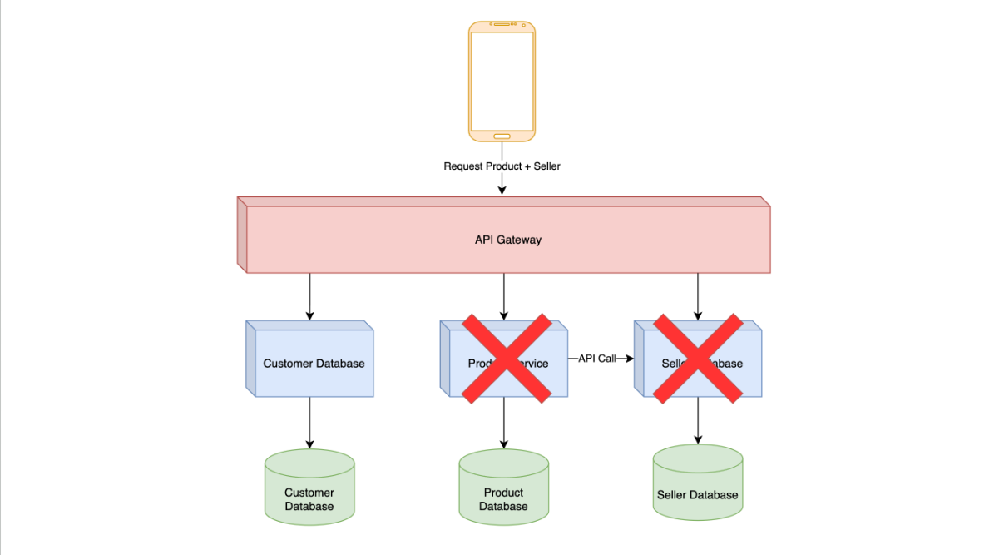

# Event Driven Architecture

## Masalah Microservices Architecture

- Dengan meningkatnya penggunaan Microservices, akhirnya **terdapat 1 masalah yang sering dialami** pengguna arsitektur ini, yaitu **ketergantungan** antar `Service`.
- Contoh pada kasus sebelumnya, ketika `Seller Service` bermasalah, misal mati, maka kita tidak bisa melihat data `Product`, hal ini dikarenakan `Product Service` butuh memanggil `Seller Service` ketika ingin menampilkan data `Product`.

### Diagram

## Pengenalan Event Driven

- Event Driven Architecture merupakan arsitektur yang menggunakan **Async Process** untuk saling berkomunikasi antar `Service`.
- Biasanya, pada arsitektur ini `Service` akan mengirim setiap perubahan data yg terjadi pada `Service` tersebut ke aplikasi bernama `Message Broker` dalam bentuk data Event.
- Pengirim data Event kita sebut dengan nama `Producer` / `Publisher`.
- `Service` yang membutuhkan data Event-nya akan mengambil data tersebut pada `Message Broker`.
- Penerima data Event kita sebut dengan nama `Consumer` / `Listener`.

### Diagram

## Duplicate Data

- Seperti yg sudah kita tahu, dalam Microservice terdapat aturan `Bounded Context`, dimana data hanya bisa diakses oleh `Service` itu sendiri.
- Pada kasus Event Driven Architecture, karena **kita tidak akan memanggil secara** **Sync** ke `Service` lain (seperti menggunakan API Call), maka biasnya `Service` akan meng-consume Event data dan men-duplicate data yg dibutuhkan di _database_ `Service` itu.
- Pada kasus sblmnya, contoh `Product Service` akan meng-consume data `Seller` Event, lalu menyimpan data `Seller` ke _database_ `Product` sbg **data duplicate**.

### Diagram

## Pertimbangan

- Event Driven Architecture saat ini banyak yang menggunakan, karena permasalahan yg terjadi di Microservices Architecture, namun perlu diperhatikan, **ada juga akibat yg terjadi** ketika kita menggunakan **Async Process**.
- Pada kasus sblmnya, kita harus memastikan data `Seller` Event diterima dengan baik oleh `Product Service`. Jika **gagal** secara otomatis data `Seller` tidak akan ada di _database_ `Product`.
- **Async Process** juga akan **menyebabkan** proses menjadi **delay**. Oleh karena itu, **kadang** pengguna **tidak menerima hasil secara** **_realtime_**, karena Async Process belum selesai.
- Ketika terjadi masalah pada **Async Process**, melakukan pencarian masalah **lebih sulit** dibanding Sync Process pada arsitektur Microservices.
