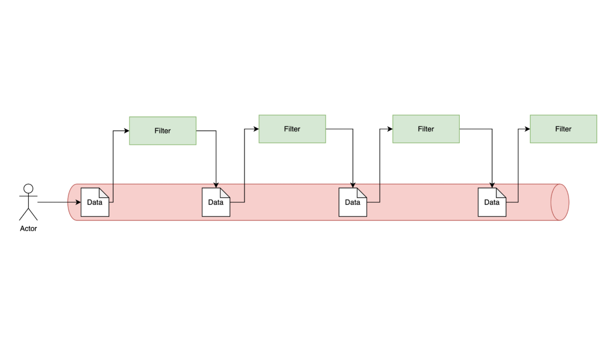
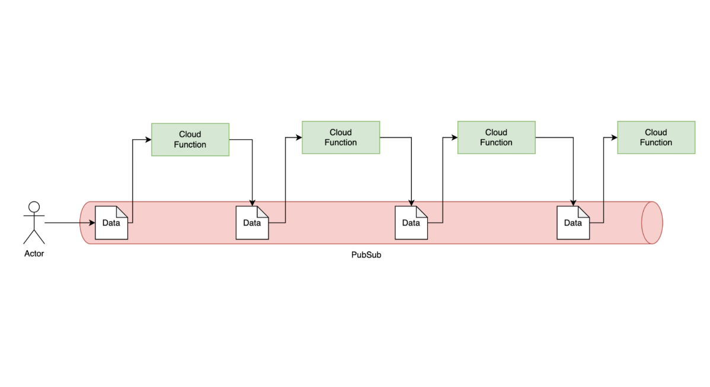
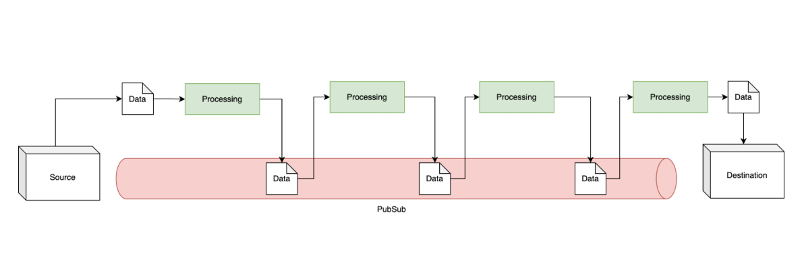
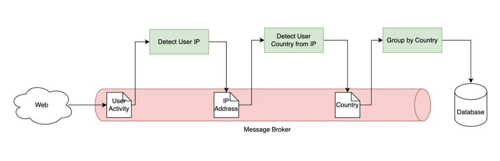

# Pipeline Architecture

## Introduction

- Pipeline Architecture adalah arsitektur yg erat kaitannya dengan `Data Stream`.
- Pada beberapa kasus, kadang kita menemui **sumber data yg masuk tanpa henti**, misal data log aktivitas pengguna misalnya.
- Pada kasus seperti ini, menyimpan data di _database_ akan \*_sangat menyulitkan untuk memprosesnya_, karena data masuk biasanya dalam jumlah banyak dan terus menerus.
- Pipeline Architecture adalah arsitektur dimana kita memanfaatkan `Message Queue` seperti Message Broker sbg **tempat aliran data**, dan kita bisa fokus untuk memproses data tersebut.

### Diagram

## Topology

- Dalam Pipeline Architecture, fokus utama adalah **proses Filter** terhadap message.
- **Tidak ada aturan** proses Filter apakah harus di dalam aplikasi yang **sama atau berbeda**, jadi **tidak ada benar atau salah**.
- FIlter biasanya adalah proses yang dilakukan dari mulai menerima input data, memproses data, dan berakhir dengan menghasilkan output data.

## Cloud Function

- Pipeline Architecture ini sekarang sangat populer di Cloud Provider seperti Google Cloud atau Amazon Web Service.
- Cloud Provider tsb sekarang memiliki fitur untuk Cloud Function, dimana bisa digunakan sebagai Filter dalam Pipeline Architecture.
- Salah satu keuntungan menggunakan Cloud Function, kita hanya perlu bayar ketiak Filter melakukan pemrosesan data.
- https://cloud.google.com/functions/docs/calling/pubsub
- https://docs.aws.amazon.com/lambda/latest/dg/with-sqs.html

### Diagram

## Data Pipeline

- Pipeline Architecture juga sering digunakan dalam melakukan pengolahan data, atau sering dikenal dengan nama **Data Pipeline**.
- Dalam Data Pipeline, biasanya terdapat _Source_, _Destination_, dan _Preprocessing_.

### Diagram

## Contoh

- Kita ingin membuat laporan jumlah pengunjung harian website kita, dimana pada laporan tersebut, kita bisa melihat jumlah pengunjung berdasarkan negara pengunjung
- Pada kasus ini, kita bisa menggunakan Pipeline Architecture
- Dimulai dari setiap data kunjungan ke website kita, kita akan kirim sebagai **event ke Message Broker**, lalu kita akan buat filter, dari filter untuk mendeteksi ipaddress, filter untuk mendapatkan negara berdasarkan ip, dan filter untuk melakukan grouping berdasarkan negara.

### Diagram

## Pertimbangan

- Pipeline Architecture merupaka arsitektur yg sangat cocok ketika kita ingin melakukan **pemrosesan yang sangat panjang** dan **bertahap**.
- Pipeline Architecture bisa sangat lama melakukan pemrosesan, tergantung seberapa panjang Filter yg ada. Oleh karena itu, tidak cocok untuk melakukan pekerjaan yg butuh waktu _realtime_.
