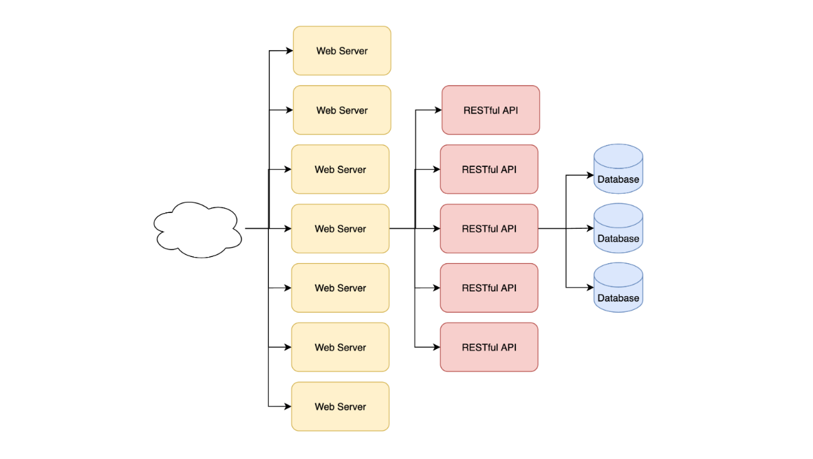
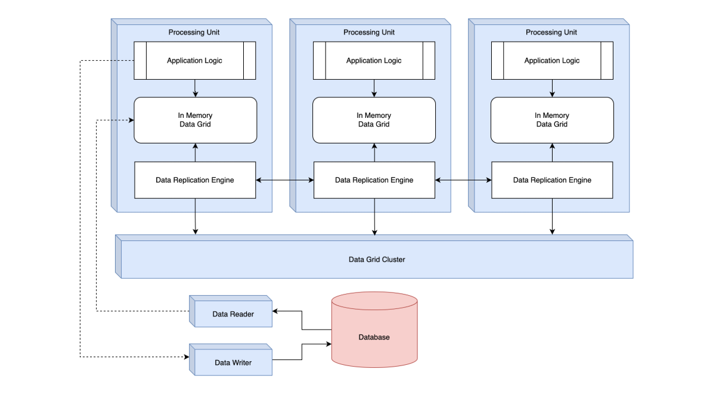

# Space Based Architecture

## Triangle-Shaped

- Pada kasus tertentu, ada jenis aplikasi yang biasanya **memiliki traffic pengunjung yg tidak terduga**, misalnya website _flashsale_, penjualan tiket, atau bidding.
- Arsitektur - arsitektur sebelumnya kita bahas, sebenarnya bisa kita gunakan untuk membuat jenis aplikasi tersebut, namun pada kasus tertentu, **kadang akhirnya kita mendapatkan permasalahan** `triangle-shaped`.

### Diagram

## Triangle-Shaped Topology

- Triangle-Shaped Topology adalah kondisi dimana kita melakukan _scalability_ dengan cara **menambahkan jumlah aplikasi** ketika terjadi kelambatan di sistem kita.
- Pada kasus ketika membuat web, untuk menambahkan **jumlah web server biasanya sangat mudah**, karena hanya menyediakan website user interface, selanjutnya biasanya kelambatan akan berpindah ke server Backend misalnya RESTful API.
- Selanjutnya biasnya kita akan menambahkan jumlah RESTful API, namun tidak sebanyak Web Server, karena biasanya aplikasi lebih berat dan membutuhkan _resources_ lebih besar, selanjutnya kelambatan akan berpindah ke _database_.
- Pada kasus seperti ini, menambah server di _database_ **bukanlah hal yg mudah**, tidak se-flexible Web Server dan RESTful API, karena _database_ adalah aplikasi **statefull**.

## Space-Based Architecture

- Space-Based Architecture merupakan arsitektur yang di desain khusus untuk kasus seperti ini, dimana kita **butuh scalability dan performa yang baik untuk aplikasi**.
- Space-Based Architecture menyelesaikan masalah ini, dengan cara **menghapus database dari proses transaksi aplikasi**, dan **diganti** dengan **shared-memory (Data Grid)**.
- High Scalability dicapai dengan cara **semua aplikasi terkoneksi ke shared-memory (Data Grid) secara synchronous**, dan secara **asynchronous data di shared-memory akan di sync ke database**.

### Diagram

## Topology

- Dalam Space Based Architecture, aplikasi yg kita buat disebut dengan **Processing Unit**.
- Dalam Processing Unit, terdapat **logic aplikasi** kita dan juga berisi **In Memory Data Grid** yang digunakan sbg pengganti _Database_.
- Biasanya terdapat **Data Replication Engine** yang digunakan untuk melakukan **sinkronisasi** seluruh data di In Memory Data Grid untuk semua Processing Unit dengan **dibantu oleh Data Grid Cluster**.
- Jika kita mau, kita bisa secara `async` menyimpan perubahan yg terjadi di In Memory Data Grid ke Database.

## Contoh Data Grid

- Biasanya Data Grid **tidak perlu dibuat secara manual** oleh pengembang aplikasi, sama seperti Database, kita bisa menggunakan aplikasi Data Grid yang sudah tersedia, seperti:
  - Hazelcast https://hazelcast.com/
  - Apache Ignite https://ignite.apache.org/
  - Oracle Coherence https://www.oracle.com/java/coherence/
  - Dan lain-lain

## Pertimbangan

- Space Based Architecture merupakan solusi yg **sangat kompleks** untuk mencapai **scalability yang sangat baik**.
- Namun walaupun solusi ini sangat baik, tapi **kadang** solusi ini **bukan yg terbaik**, kita harus **melihat banyak pertimbangan** ketika menggunakan arsitektur ini.
- Contoh jika **data kita terlalu besar**, maka akan sulit menggunakan arsitektur ini karena seluruh data harus dipindahkan ke `memory` yang pasti butuh biaya yang sangat besar.
- Karena **kompleksitasnya** dan **mahalnya** solusi ini, kita juga harus **mempertimbangkan biaya** yg harus dikeluarkan untuk menggunakan arsitektur ini.
